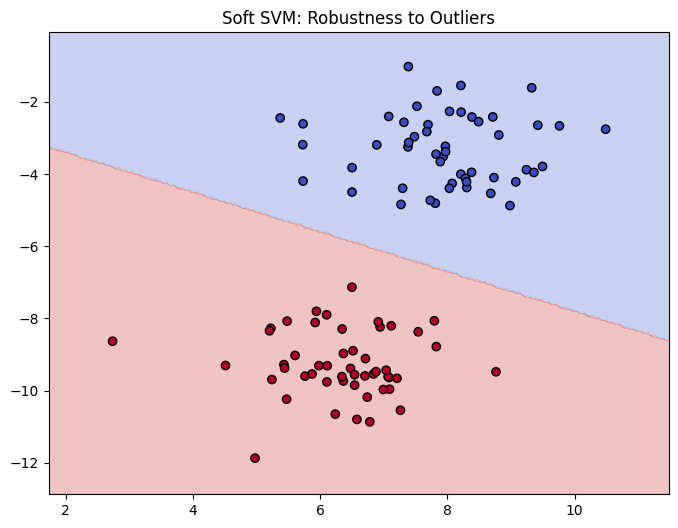
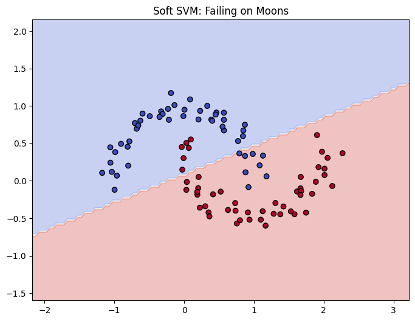
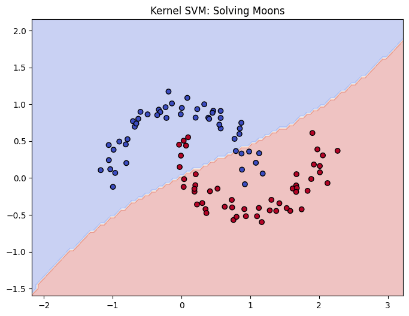
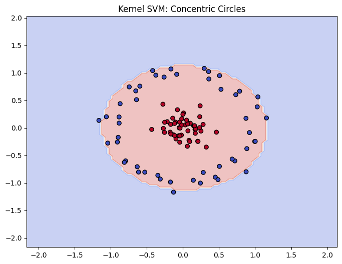

# svm-evolution

This repository provides from-scratch implementation of linear and non-linear classifiers using Python and NumPy. The objective of this project is to demonstrate the mathematical and algorithmic progression that led to modern Support Vector Machines. 

This project highlights the limitations of early models.

## Exploring Algorithm Limits

This project demonstrates the necessity of each algorithm by pushing them to their limits using edge-case datasets.

### 1. The Hard Margin Trap (Outliers)
When a single outlier breaks linear separability, a Hard Margin SVM cannot mathematically converge. The **Soft Margin SVM** utilizes the Hinge Loss function with L2 regularization to allow margin violations, maintaining a logical decision boundary.



### 2. The Linear Limit (Moons Dataset)
Linear classifiers inherently fail on data that requires a curved boundary. 



By applying the **Sequential Minimal Optimization (SMO)** algorithm with a **Gaussian Kernel**, the SVM projects the data into a higher-dimensional space.



### 3. The Ultimate Test (Concentric Circles)
The **Gaussian Kernel** proves its extreme flexibility on datasets where classes enclose one another, completely separating the inner and outer circles.



## Implemented Algorithms

The project is structured around four core implementations:

1. **Perceptron (`src/perceptron.py`)**
   * Implements the classic error-driven learning algorithm.
   * **Limitation:** Finds any separating hyperplane without optimizing for the margin, leading to poor generalization. It fails to converge on non-linearly separable data.

2. **Hard Margin SVM (`src/hard_svm.py`)**
   * Introduces margin maximization. The objective is updated to ensure data points are not just correctly classified, but lie outside a defined margin.
   * **Limitation:** Strictly requires linearly separable data. The presence of outliers or overlapping classes prevents convergence.

3. **Soft Margin SVM (`src/soft_svm.py`)**
   * Introduces the Hinge Loss function and an L2 regularization term to allow for misclassifications (soft margin). Optimized using Stochastic Gradient Descent (SGD).
   * **Limitation:** While robust to noise and outliers, it is still restricted to linear decision boundaries.

4. **Kernel SVM with SMO Algorithm (`src/svm_smo.py` & `src/kernels.py`)**
   * Solves the dual optimization problem using Sequential Minimal Optimization (SMO) algorithm.
   * Leverages the Kernel Trick (Linear, Polynomial, and Gaussian) to project data into higher dimensions, allowing the model to learn complex, non-linear decision boundaries.

## Repository Structure

```text
.
├── src/
│   ├── base.py             # Base class for all classifiers (NotImplementedError pattern)
│   ├── perceptron.py       # Standard Perceptron implementation
│   ├── svm_hard.py         # Hard Margin SVM 
│   ├── svm_soft_sgd.py     # Soft Margin SVM optimized via SGD
│   ├── svm_smo.py          # Dual SVM optimized via SMO algorithm
│   └── kernels.py          # Linear, Polynomial, and RBF kernel functions
├── notebooks/
│   └── demonstrations.ipynb # Visualizations of decision boundaries and margins
├── tests/
│   └── test_models.py      # Unit tests verifying algorithm correctness
├── requirements.txt        # Project dependencies
└── README.md
