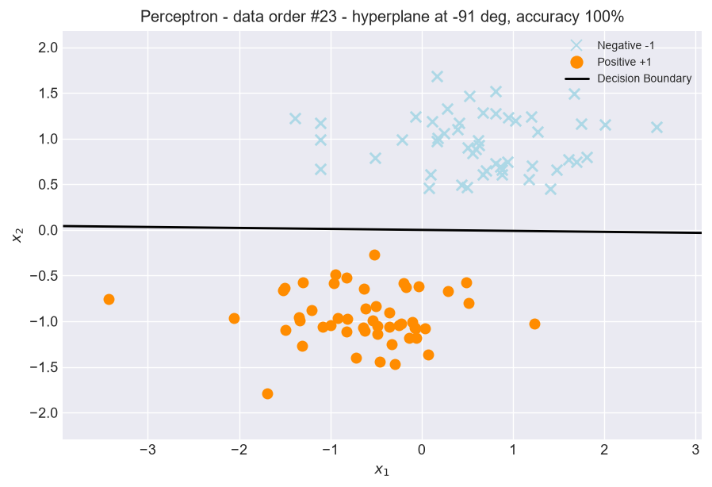
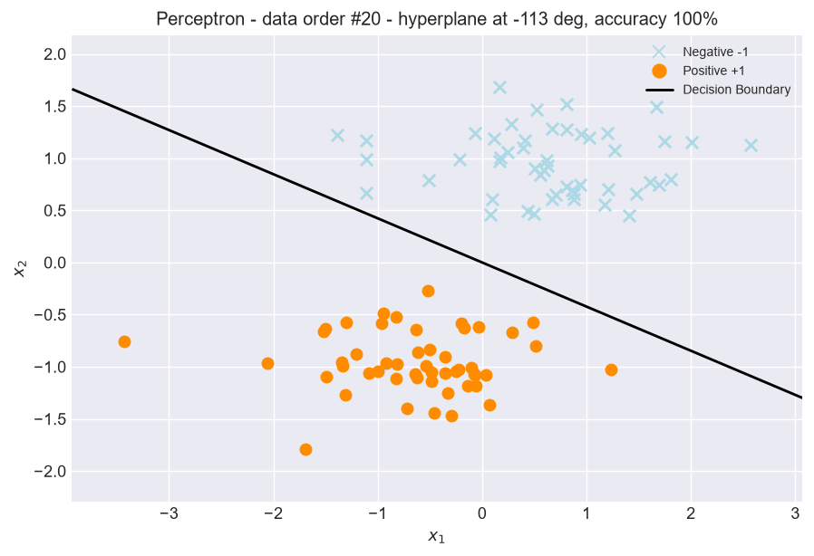
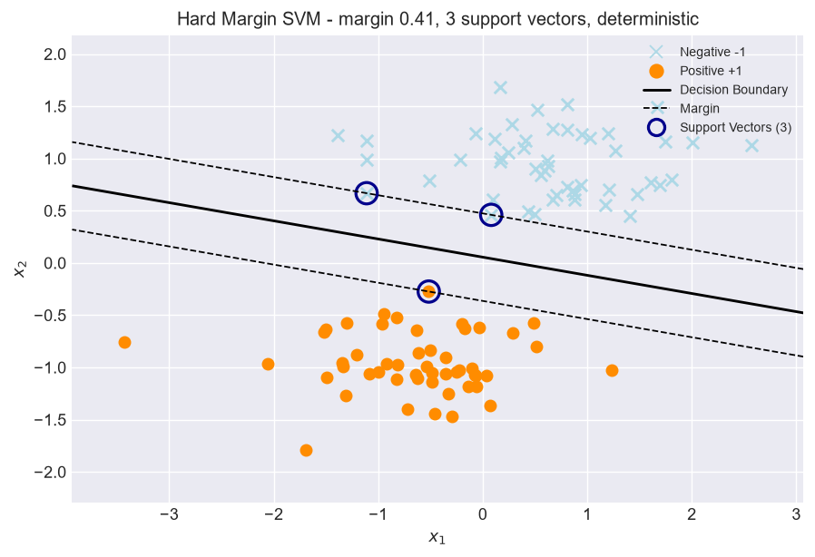
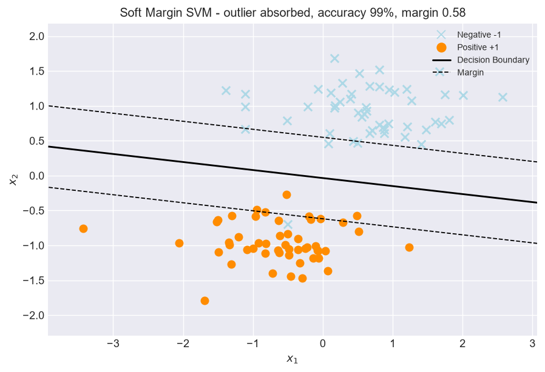
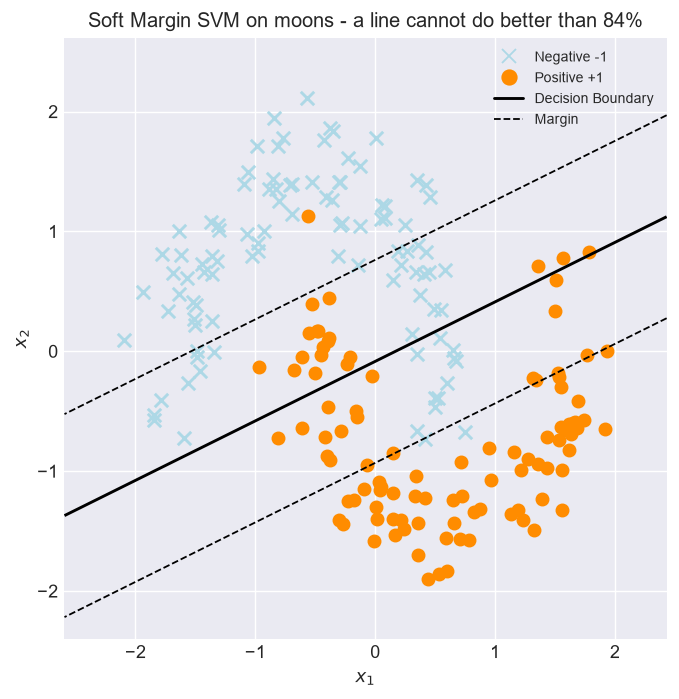
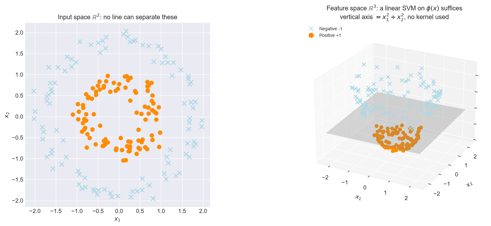
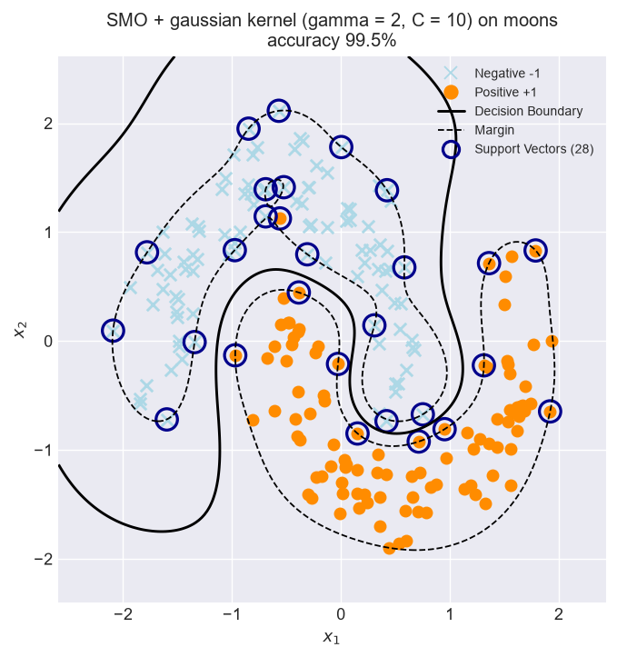
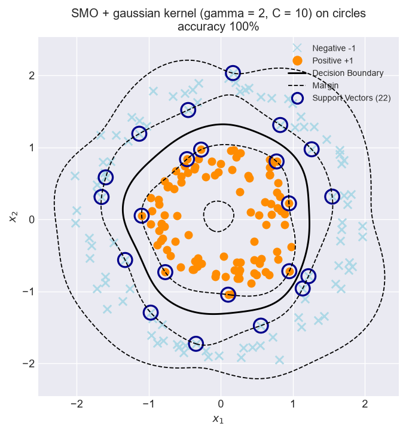
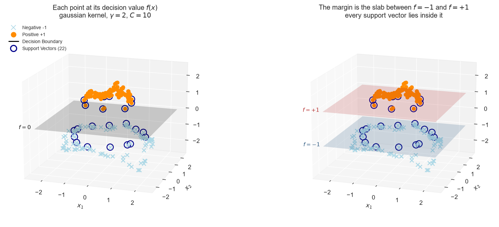
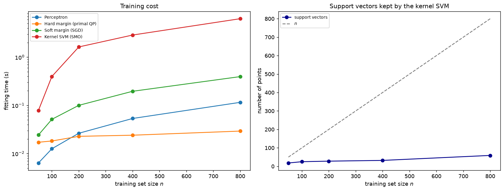

# svm-evolution-from-scratch

From-scratch implementations in NumPy of the four classifiers that led to the
modern Support Vector Machine: the perceptron, the hard margin SVM, the soft
margin SVM, and the kernel SVM trained by Sequential Minimal Optimization.

## How this project started

It all started when I watched this[YouTube video](https://youtu.be/_PwhiWxHK8o) and finished it with two questions the
video had not answered.

The first was about the constraint itself. Every derivation writes

```
y_i (w · x_i + b) >= 1
```

and moves on. Why `1`? Why a threshold at all, rather than simply asking that
the points be on the correct side? The second question was about what happens
after training. The video explained how the model is fitted, but not what a
prediction actually computes — and for a kernel SVM, where no explicit `w`
exists, that turns out to be the more interesting half of the story.

Looking for answers took me backwards rather than forwards. I ended up reading
about the perceptron, working through the linear algebra behind it, and drawing
what each iteration does to the vector `w` geometrically. That raised a third
question: if the perceptron already finds a separating hyperplane, why invent
the SVM at all?

Answering that one required the whole sequence — hard margin, then soft margin,
then the kernel trick — and each step turned out to be motivated by a concrete
failure of the one before it. This repository is that sequence, implemented and
illustrated, with the failures shown rather than asserted.

---

## Step 1 — The perceptron, and what it leaves undecided

The update rule is the whole algorithm: while a point is misclassified, move
the hyperplane towards it.

```
w <- w + eta * y_i * x_i
b <- b + eta * y_i
```

On separable data this terminates, and every point ends up correctly
classified. But nothing in the rule refers to the *distance* between the
hyperplane and the data, so the algorithm stops at the first separator it
stumbles upon. Feed it the same points in a different order and it answers
differently:

| | |
|---|---|
|  |  |

Both are perfect classifiers of the training set. Both would generalise
differently on the next point that arrives. That ambiguity is what the SVM
removes.

## Step 2 — The hard margin, and why the threshold is 1

Here is the answer to my first question. A hyperplane is invariant under
rescaling: `(w, b)` and `(kw, kb)` describe the same set for any `k > 0`. So
asking for `y_i (w · x_i + b) >= c` is the *same* constraint whatever positive
`c` you pick — you are only choosing how to normalise `w`. Fixing `c = 1` pins
that scale, and once it is pinned the margin has a closed form:

```
margin = 1 / ||w||
```

Maximising the margin becomes minimising `||w||^2`, and the whole thing is a
quadratic program with linear constraints. The threshold is a normalisation,
not a modelling decision.



One solution, not many. The dashed lines are the margin, and the three circled
points are the only ones touching it — the support vectors. Moving any other
point does nothing at all.

## Step 3 — The soft margin, because "no solution" is a real outcome

Drop a single point inside the opposite class and the constraints become
impossible to satisfy simultaneously. Not slow to satisfy: impossible. The
feasible set is empty and the program has no solution, which my implementation
reports rather than papering over:

```
NotSeparableError: The data is not linearly separable:
no (w, b) satisfies y_i (w . x_i + b) >= 1 for every i.
```

Slack variables relax the constraints to `y_i f(x_i) >= 1 - xi_i`. Eliminating
them at the optimum leaves an unconstrained objective:

```
minimise  lambda ||w||^2 + (1/n) sum_i max(0, 1 - y_i f(x_i))
```

That second term is the hinge loss — so the hinge loss *is* the soft margin
formulation, with the slacks removed. Violations are now priced instead of
forbidden, and the boundary survives the outlier:



This also explains why the hard margin here is solved as a constrained program
and not by gradient descent: an objective that prices violations always has a
finite minimum, so it can never tell you that a problem is infeasible.

## Step 4 — The kernel trick, because a line is sometimes hopeless

No straight line separates two interleaved crescents. The soft margin does its
honest best and plateaus:



The way out is to change space rather than to change line. Lifting the data
through a feature map `phi` can make it linearly separable — here
`phi(x) = (x1, x2, x1^2 + x2^2)` turns two concentric circles into two clouds
at different heights, separated by an ordinary plane:



The problem is that useful feature spaces get large fast, and the gaussian one
is infinite-dimensional. This is where the dual formulation earns its place:
written in terms of the multipliers `alpha`, the data appears *only* inside
inner products, which can be replaced by a kernel `K(x_i, x_j)` without ever
computing `phi`.

```
maximise  sum_i a_i - (1/2) sum_i sum_j a_i a_j y_i y_j K(x_i, x_j)
```

And here is the answer to my second question — what a prediction computes.
There is no `w` to store any more, because it lives in a space we deliberately
never visit. What gets stored are the support vectors and their multipliers:

```
f(x) = sum_i a_i y_i K(x_i, x) + b
```

One kernel evaluation per support vector. Solving that dual with SMO gives a
boundary no line could produce:

| | |
|---|---|
|  |  |

### Seeing the decision function itself

Since `f(x)` is now a number attached to every point, it can be used as a
height. Drawing each training point at `(x1, x2, f(x))` shows what the model
really does with the circles:



The boundary is where the cloud crosses `f = 0` — a curve in the input plane,
not a region. The margin is the slab between `f = -1` and `f = +1`, and every
support vector lies inside it or exactly on its edges. Note the difference with
the previous 3D figure: there the vertical axis was a coordinate of the feature
space, here it is the *output* of the model, which is why the boundary and
margins are flat planes.

## What a kernel costs

Beyond accuracy, a model has to be trained and then served, and the four
implementations differ sharply on both.



The perceptron and the SGD soft margin are linear in the sample size. SMO is
clearly superlinear: the Gram matrix alone is `n × n`. The hard margin QP looks
flat, and that is not an accident — solved in the **primal**, its unknowns are
just `w` and `b`, so its size barely depends on `n` at all. In the dual it
would have one variable per training point. The primal is cheap when the data
is low-dimensional and plentiful; the dual is the only one that admits kernels.

Prediction splits the same way. A linear model compresses its training set into
a single vector and answers with one dot product. A kernel model keeps part of
its training set forever and consults it every time — on the same data,
prediction is several orders of magnitude slower.

What keeps that tractable is sparsity: only the support vectors are kept, a
small fraction of the training set, and the right-hand panel shows their number
growing far more slowly than `n`. This follows directly from the hinge loss
being exactly zero beyond the margin, which forces most multipliers to zero. A
kernelised logistic regression, whose loss never vanishes, would have to keep
every single point.

---

## Running it

```bash
pip install -r requirements.txt
python generate_visuals.py    # regenerates every figure above
python benchmark.py           # reproduces the timing figure
```

```
.
├── src/
│   ├── base.py             # shared interface, NotSeparableError
│   ├── perceptron.py       # Perceptron
│   ├── svm_hard.py         # hard margin, primal QP with cvxopt
│   ├── svm_soft_sgd.py     # soft margin, hinge loss by SGD
│   ├── svm_smo.py          # dual with kernels, solved by SMO
│   ├── kernels.py          # linear, polynomial, gaussian
│   └── plotting.py         # figure styling, 2D and 3D
├── generate_visuals.py
├── benchmark.py
└── figures/
```
